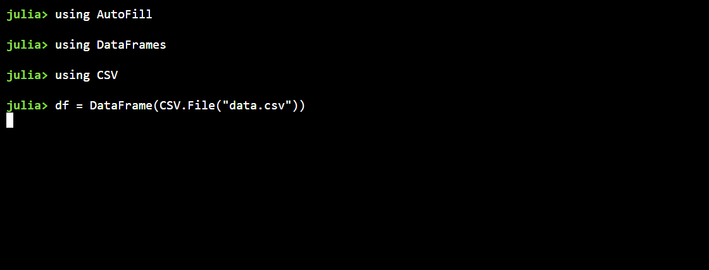

# AutoFill

This package provides ability to automatically fill-in data in tables using Programming by Example (PBE) techniques described in [FlashFill](https://www.microsoft.com/en-us/research/publication/automating-string-processing-spreadsheets-using-input-output-examples/). 

This package has been inspired from previous implementation of Flashfill found [here]()

Example usage -

